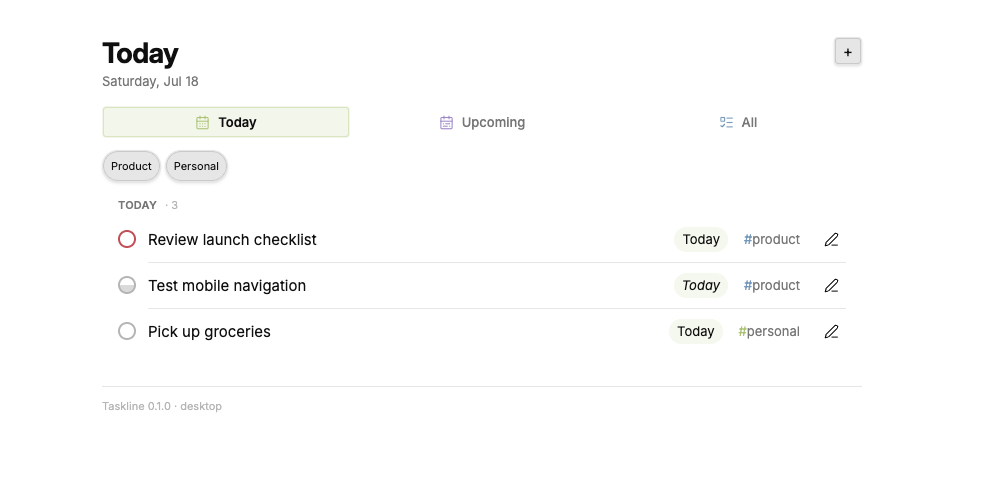

# Taskline

Taskline is an Obsidian task dashboard and quick-capture plugin. It reads tasks from the notes you choose, groups them into a focused Today view, and writes changes back to Markdown.

Taskline does not create task notes during setup. You keep control of every source path, heading, route, and display group.



## Features

- Today, Upcoming, and All task views
- Natural-language capture for dates, priorities, recurrence, tags, and owners
- Configurable task sources, headings, areas, and capture routes
- Inline task editing, status changes, and completion
- Desktop and mobile layouts with keyboard navigation
- Local-only operation with no accounts, telemetry, or network requests
- Optional proposal rows for reviewing suggested completions or cancellations

## Example Workflow

Your next actions already exist. They are just scattered across meeting notes, transcripts, and messages.

Here is one way to turn that noise into a single execution queue:

1. Capture meeting notes with a tool such as Granola or Google Meet's Gemini notes, then save them to your Obsidian vault.
2. Ask an AI agent to review those notes and write your action items as Markdown tasks under the headings Taskline reads.
3. Point Taskline at those notes. New action items automatically appear alongside the rest of your work in Today, Upcoming, and All.
4. Add Slack the same way: run an agent each night to review selected conversations, extract the tasks assigned to you, and write them to a configured note in your vault.

Instead of rereading every transcript and message to reconstruct what you owe, you open one view and start executing. Taskline is the final mile between agent-generated action items and the work you need to do.

Taskline does not connect to meeting or messaging services itself. Your capture tools and agents write the Markdown; Taskline stays local and turns the notes you choose into a focused task system.

## Requirements

- Obsidian 1.5.0 or later
- Markdown task notes that use `- [ ] Task` syntax
- The [Tasks plugin](https://github.com/obsidian-tasks-group/obsidian-tasks) only if you complete recurring tasks through Taskline

Taskline can read and edit non-recurring tasks without the Tasks plugin.

## Install

Taskline is not yet listed in the Obsidian Community plugins directory.

To install a release manually:

1. Download `main.js`, `manifest.json`, and `styles.css` from the release.
2. Create `<vault>/.obsidian/plugins/vault-tasks/`.
3. Place all three files in that folder.
4. Reload Obsidian.
5. Enable **Taskline** under **Settings** -> **Community plugins**.

The folder is named `vault-tasks` because Obsidian requires it to match the stable plugin ID in `manifest.json`.

## Configure

Open **Settings** -> **Taskline**. Taskline starts unconfigured and inactive. Add the source notes and level-two (`##`) task headings you want, then select **Apply**.

The settings UI accepts JSON arrays so related routes and groups can be edited together. This minimal configuration reads one note and captures new tasks under its `Inbox` heading:

**Task sources**

```json
[
  {
    "id": "tasks",
    "label": "Tasks",
    "path": "Tasks.md",
    "role": "tasks",
    "editPolicy": "stay",
    "proposals": false
  }
]
```

**Areas**

```json
[
  {
    "id": "inbox",
    "label": "Inbox",
    "sourceId": "tasks",
    "heading": "Inbox"
  }
]
```

**Display order**

```json
["inbox"]
```

**Fallback capture destination**

```json
{
  "sourceId": "tasks",
  "heading": "Inbox"
}
```

Source paths must be relative to the vault. Taskline rejects absolute paths and paths containing `..`. Configured destinations must already exist as level-two headings; Taskline never creates notes or headings implicitly.

## Capture Tasks

Run **Taskline: Add task** from the command palette. Taskline recognizes common shorthand:

```text
Send report by tomorrow !! #work
Plan review next week #planning
Publish notes every Friday @alex
```

- `!`, `!!`, and `!!!` set medium, high, and urgent priority. `priority:low` sets low priority.
- Dates such as `today`, `tomorrow`, `next week`, `Jul 5`, and `2026-07-05` set the due date.
- `daily`, `weekly`, and phrases such as `every Friday` set recurrence.
- `#tag` selects a configured route or keeps a generic tag.
- `@owner` records an owner.

Taskline writes Tasks-compatible signifiers at the end of each task line.

## Development

```bash
npm ci
npm test
npm run build
```

The production build writes `main.js` at the repository root.

## Privacy and Security

Taskline reads and changes only the vault files configured as task sources. It does not send data off-device. See [SECURITY.md](SECURITY.md) to report a vulnerability.

## License

[MIT](LICENSE)
